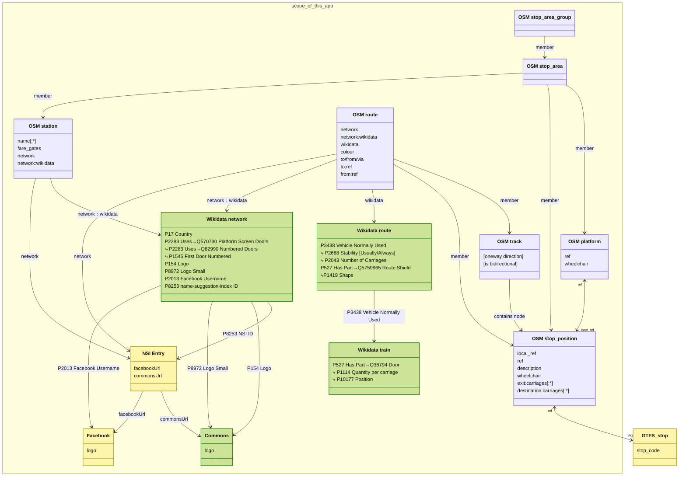

# Subway Exit Map

🚇🛗 Some subway or train platforms only have an exit on one end of the platform, which means people might need to walk a long distance down the platform if they arrive in the wrong carriage.

This app uses [data from OpenStreetMap](https://osm.wiki/Key:exit:carriages) to show which carriage of a train is the closest to the exit when arriving at the station, to avoid a long walk down the platform to the exit or elevator.

## [Demo App](https://exits.to) — [API](https://kyle.kiwi/subway-exit-map/api.json) — [Data Model](https://osm.wiki/Key:exit:carriages)

### License

- [The data](https://kyle.kiwi/subway-exit-map/api.json) is sourced from OpenStreetMap and licensed under the [ODbL license](https://osm.org/copyright). Some complementary data is also souced from [Wikidata](https://wikidata.org), and licensed under the [Creative Commons CC0 license](https://wikidata.org/wiki/Wikidata:Copyright).
- The code is licensed under the [MIT license](./LICENSE).

### Data Sources

Every OpenStreetMap feature with an [`exit:carriages[:*]`](https://osm.wiki/Key:exit:carriages) tag is extracted.
Many related entities are then fetched using an Overpass and SPARQL query, as shown in the following diagram (colour coded by data source):

### Regions with Data

This map is [automatically generated](./script/build/generateReadmeMap.ts) from the OpenStreetMap data.
A more precise map is [available from _taginfo_](https://taginfo.osm.org/keys/exit:carriages:forward#map).

